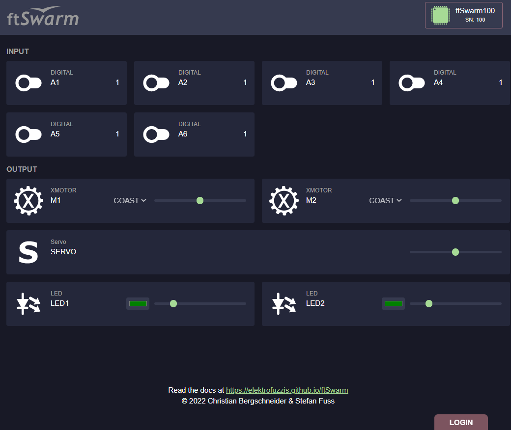

To get several ftSwarm controllers to act as a swarm, they must communicate with each other. This usually takes place via wifi, the ftSwarmRS is able to communicate via RS485, too. Additionally the status page of the controller can be accessed via wifi. Here the the input signals are shown; motors, servos and LEDs can be controlled manually.

Wifi configuration needs a USB connection. Start a terminal program as described before and boot the controller via the reset button.

The controller now shows its boot message. Press any key, so that you enter the configuration menu of the ftSwarm firmware:

```
ftSwarmOS 0.5.0

(C) Christian Bergschneider & Stefan Fuss

Main Menu

(1) wifi & Web UI
(2) swarm configuration
(3) alias names
(4) factory reset
(5) remoteControl
(6) extention port

(0) exit
main>
```

Choose  **(1) Wifi & WebUI**. Configure *CLIENT-MODE* and add you wifi's credentials:

```
Wifi & WebUI

(1) wifi:           CLIENT-MODE
(2) SSID:           <WLAN-Name/SSID>
(3) Password:       <WLAN-Passwort>
(4) Web UI:         on
(5) ftPixels in UI: 2

(0) exit
Wifi & WebUI>
```

Use **(0)** to save your changes. The controller will restart and connect to your local wifi..

You could now access the statuspage by **`http:\\ftSwarm<SerialNumber>`**. Replace <SerialNumber> with the serial number of your ftSwarm controller.



*In case of any problem, please check*
- *if your browser has java script enabled*
- *and your wifi allows a direct peer-to-peer communication.*

To operate the actuators such as motors, you need to log in to the controller using the LOGIN button. Thereby the swarm pin is requested, by default this is the 4-digit serial number of the controller (in the example 0100).